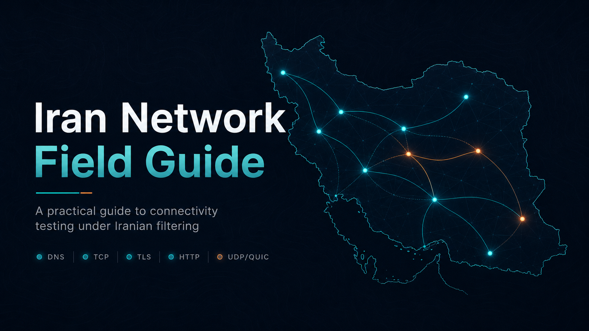

<div align="center">

# Iran Network Field Guide



**A practical map for testing connectivity under Iranian filtering.**

[Overview](docs/01-iran-internet-overview.md) ·
[Choose a route](guides/choosing-a-route-family.md) ·
[Run tests](guides/testing-from-iran.md) ·
[Route matrix](docs/13-route-family-matrix.md) ·
[Report safely](templates/field-report-template.md)

</div>

---

## What This Helps With

Iran connectivity failures are rarely one clean block. The same route can behave differently by operator, city, network type, time window, client app, DNS path, CDN edge, endpoint reputation, UDP handling, and TLS behavior.

This guide gives researchers, operators, and testers a shared language for answering four practical questions:

| Question | Where to start |
|---|---|
| What kind of failure is this? | [Censorship mechanisms](docs/02-censorship-mechanisms.md) |
| Which route family should we test next? | [Route family matrix](docs/13-route-family-matrix.md) |
| Which client apps can realistically use it? | [Client compatibility](docs/06-client-compatibility.md) |
| How do we collect clean field results? | [Testing from Iran](guides/testing-from-iran.md) |

## Fast Path

1. Read the [overview](docs/01-iran-internet-overview.md) to understand the network states.
2. Match symptoms with [choosing a route family](guides/choosing-a-route-family.md).
3. Run a staged probe with [connectivity_probe.py](tools/connectivity_probe.py).
4. Summarize the result with [result_summarizer.py](tools/result_summarizer.py).
5. Share only a sanitized report using the [field report template](templates/field-report-template.md).

## Failure Stage Map

| Stage | What it means | Useful next move |
|---|---|---|
| DNS | Hostname does not resolve or resolves inconsistently | Compare resolvers and record answers |
| TCP | Endpoint or port cannot be reached | Compare provider, CDN, or relay paths |
| TLS | Handshake fails after TCP connects | Review SNI, certificate, ALPN, and fingerprint behavior |
| HTTP | Fallback page or upgrade path fails | Check Host, path, CDN rules, and origin behavior |
| UDP/QUIC | UDP-style transport fails or stalls | Compare with a TCP branch before promoting it |
| Proxy/app | Connection opens but useful traffic fails | Record client version, route family, and user-visible behavior |

## Route Family Snapshot

| Route family | Best use | Common risk | Practical status |
|---|---|---|---|
| DNS tunnel plus UDP relay | Full-device Android and call-like traffic when DNS paths survive | Endpoint visibility and resolver behavior | Strong private field signal |
| Direct TLS camouflage | Fast ordinary-filtering route | Endpoint or provider reputation | Useful fast branch |
| WebSocket/TLS CDN | Common-client compatibility with CDN indirection | Old WebSocket fingerprints and path mismatch | Practical, needs careful setup |
| XHTTP-style transport | Newer HTTP-shaped experiments | Uneven client support | Staged experiment |
| CDN edge comparison | Per-operator edge behavior testing | Candidate edges age quickly | Use as a measurement method |
| Google/API relay | Whitelist-like periods where selected platforms remain reachable | Quotas, latency, account risk | Useful fallback research |
| Domestic-service/WebRTC relay | Web and messaging in whitelist-like states | Metadata exposure and unstable calls | Emergency web/messaging branch |
| Fragmentation or DPI desync | Lab testing against traffic classification | Platform privileges and version drift | Lab-only unless common clients support it |

## Tools

Run only against endpoints you own or are explicitly authorized to test.

```bash
python tools/connectivity_probe.py --hostname EXAMPLE_HOSTNAME --route-family "WebSocket/TLS CDN"
```

```bash
python tools/cloudflare_edge_probe.py --hostname EXAMPLE_HOSTNAME --ip EXAMPLE_CDN_EDGE_IP
```

```bash
python tools/result_summarizer.py data/examples/sanitized-results.json
```

```bash
python tools/redaction_scan.py .
```

## Evidence Labels

| Label | Meaning |
|---|---|
| Confirmed from project field notes | Observed in private field work, then rewritten as public route-family guidance |
| Confirmed from upstream source/docs | Based on upstream documentation or source behavior |
| Inference | Engineering conclusion from protocol behavior or repeated observations |
| Unverified field report | Reported but not independently repeated |
| Unknown | Not enough evidence |

## Repository Map

| Path | Purpose |
|---|---|
| `docs/` | Technical overview, mechanisms, route-family analysis, open questions |
| `guides/` | Field testing, route selection, practical reporting |
| `templates/` | Placeholder profiles, test matrices, report templates |
| `tools/` | Local diagnostics and redaction checks |
| `data/examples/` | Sanitized sample outputs |

## Scope

This project documents methods, route families, and measurement workflows. It does not publish live deployments.

Tor-dependent workflows are out of scope; see [the scope note](docs/12-no-tor-scope-note.md).

## Contributing

Good contributions are specific, evidence-labeled, and practical:

- A sanitized field report.
- A client compatibility correction.
- A route-family failure analysis.
- A safer diagnostic workflow.
- A clearer explanation for people outside Iran.

Before submitting, run:

```bash
python tools/redaction_scan.py .
python -m py_compile tools/*.py
```
